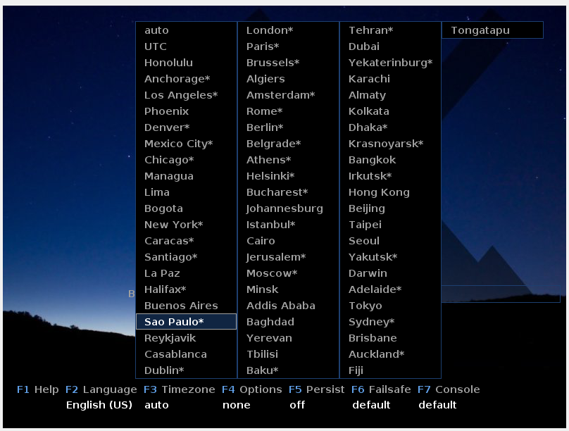

# Manual-MX

O que é o Sistema Operacional MX?

O MX é uma distribuição Linux leve e rápida, projetada para ser eficiente em computadores mais antigos ou com recursos limitados. É baseada no Debian e usa o ambiente de desktop Xfce, conhecido por ser leve e responsivo.

Essa é a sua imagem logo..

## Passo a Passo da sua intalação

1. Passo (Linguagem e Horário):

 
 
 Ao baixar o Sistama, você provavelmente se encontrará nessa tela. Indicamos logo de ínicio, que você já mude as configurações de linguagens e horario. 
 
 Para isso, faça as seguintes ações:

Para alterar a linguagem cique na tecla "F2" de seu teclado. Ao fazer isso surgirá a seguinte tela:

Selecione a sua linguagem preferida e aprete ENTER, assim seguimos adiante. Para mudar o Horário, deve ter ficado mais facil. Ao observar no rodapé da tela inical, você vera que, ao apertar a tecla "F3" entrará na opção "Fuso Horário"

em seguida seleciona umas das cidade para o horário desejavel.

---

2. Passo

Tudo feito do passo 1, selecione a primerira opção e clique em ENTER

 
 Espere carregar.. Agora você deve se encontrar nessa aba, certo?

 Em seguida, clique em " Instalar o MX Linux".

 ---

 3. Passo (Prosseguimento)

 

 Espere a instalação terminar...
 

Clique em "Proximo".

Clique em "Iniciar".

Pode seguir clicando em "Proximo".

Verifique se as suas informações estão corretas. Caso esteja, clique em "Proximo".

Agora, preencha os dados de sua escolha  e clique em "Proximo".

Depois da instalação ser concluída, clique em "Finalizar".

Ao fazer isso, você será encainhado para essa pagina:

Pressione ENTER para terminar a instalação.

---

4. Passo

Depois de ter concluido todos os passos, você então concluiu a instalação. Agora aproveite seu novo Sitema Operacional :)

---

